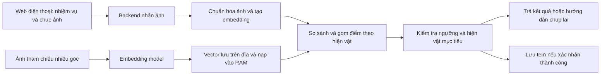

**Đánh giá và kế hoạch: săn tìm hiện vật, sưu tập tem**

Ngày lập: 22/09/2026. Cơ sở: `idea.md`. Đây là kế hoạch đề xuất; chưa có dữ liệu ảnh hoặc kết quả thử nghiệm để khẳng định độ chính xác.

**1. Nhận xét tổng thể**

Ý tưởng hợp lý để làm PoC: vòng trải nghiệm “đọc manh mối → tìm vật → chụp ảnh → nhận tem → đọc câu chuyện” rõ ràng, và 5–7 vật phẩm là phạm vi khởi đầu phù hợp. Giá trị cần kiểm chứng là người dùng quan sát và tìm hiểu hiện vật nhiều hơn, đồng thời ít bị gián đoạn bởi việc nhận diện sai.

Điểm khó nhất là xác nhận đúng hiện vật cụ thể. Một hệ thống tìm ảnh tương tự có thể thấy hai chiếc bình khác nhau đều rất giống ảnh truy vấn. Vì vậy, kết quả gần nhất chưa đủ để tự động cấp tem.

| Nội dung trong ý tưởng | Đánh giá và điều chỉnh |
| --- | --- |
| Trò chơi săn hiện vật, sổ tem | Giữ. Mỗi tem nên mở một câu chuyện ngắn và một chi tiết đáng quan sát. |
| Thay thế QR | Nên đặt mục tiêu ban đầu là thử nghiệm một cách tương tác mới. Chỉ quyết định thay thế rộng sau khi thử tại bảo tàng; cần đường hỗ trợ khi không nhận diện được. |
| Dùng image embedding | Hợp lý làm phương án nhận diện đầu tiên, nhưng phải đo khả năng phân biệt các vật cùng loại. Chỉ cần image embedding nếu PoC chưa tìm kiếm bằng văn bản. |
| Không phụ thuộc góc chụp, ánh sáng, trước/sau | Cần sửa. Đây phải là các điều kiện kiểm thử, không phải năng lực mặc định. Có thể không xác định được mặt sau nếu nó thiếu đặc điểm riêng. |
| “Fuzzy matching” | Nên gọi cụ thể là tìm kiếm độ tương đồng ảnh và xác minh bằng ngưỡng. Điểm cosine không phải xác suất nhận diện đúng. |
| Vector database chạy cục bộ | Có thể dùng, nhưng với vài chục đến vài trăm ảnh, đề xuất ban đầu là ma trận vector trong RAM, có bản lưu trên đĩa. |
| 5–7 vật, mỗi vật nhiều góc | Giữ; thêm vật gần giống nhau, ảnh ngoài danh mục và bộ ảnh kiểm thử độc lập. |

**2. Những giả định kỹ thuật cần xác minh**

OpenRouter hiện có endpoint embeddings với schema đầu vào text/token/multimodal. Danh mục model có trường `architecture.input_modalities`; cần kiểm tra model và provider cụ thể có nhận ảnh, rồi thực hiện một request thật trước khi chọn. Việc một model đọc được ảnh qua chat không đủ để kết luận nó cung cấp vector ảnh. Tham khảo [API embeddings](https://openrouter.ai/docs/api/api-reference/embeddings/submit-an-embedding-request), [danh mục embedding models](https://openrouter.ai/docs/api/api-reference/embeddings/list-all-embeddings-models) và [image inputs qua chat](https://openrouter.ai/docs/guides/overview/multimodal/image-understanding).

Chưa xác minh model OpenRouter cụ thể bằng API thật, cấu hình máy, chi phí mỗi ảnh hoặc tốc độ suy luận. Các việc này thuộc bước đầu của PoC. Không nên chốt kiến trúc phụ thuộc một nhà cung cấp trước khi hoàn thành bước đó.

**3. Phạm vi bản đầu tiên**

Giả định lập kế hoạch: một người phát triển, web dùng trên điện thoại, 5–7 vật phẩm, dữ liệu mẫu được người thực hiện dự án chuẩn bị, kết nối mạng có sẵn. Tiến độ tính theo ngày công và phụ thuộc thời gian thu thập ảnh, thiết bị và quyền truy cập API.

- Mỗi nhiệm vụ nhắm đến một hiện vật cụ thể; cho phép xem thêm gợi ý hoặc bỏ qua để quay lại.
- Chụp/tải một ảnh có một vật chính; có hướng dẫn đưa vật vào giữa khung hình.
- Kết quả gồm: đúng hiện vật, chưa đúng nhiệm vụ, chưa đủ rõ để xác nhận, hoặc lỗi xử lý/kết nối.
- Nhận tem một lần cho mỗi hiện vật; tải lại trang vẫn giữ tiến độ của phiên chơi.
- Tem dùng ảnh đại diện đã chuẩn bị kèm khung và tên. Chưa cần AI tạo ảnh.
- Nội dung giới thiệu và manh mối được biên soạn trước, có nguồn và được người phụ trách duyệt khi đưa vào bảo tàng.
- Nhập danh mục bằng file và script; giao diện quản trị hoàn chỉnh để sau.

Các phần để sau PoC: tài khoản và đồng bộ nhiều thiết bị, bảng xếp hạng, phần thưởng có giá trị, nhận diện nhiều vật trong một ảnh, AR, bản đồ trong nhà, huấn luyện riêng, ứng dụng native và vận hành nhiều bảo tàng.

Ảnh chụp màn hình hoặc ảnh in của hiện vật có thể được nhận diện giống hiện vật thật. PoC này xác minh nội dung ảnh, chưa chứng minh người chơi thực sự có mặt tại địa điểm. Nếu sau này có phần thưởng thực, cần một thiết kế xác minh riêng.

**4. Kiến trúc đề xuất**

Triển khai hiện tại dùng React/Vite + Cloudflare Worker; embedding và tìm kiếm chạy qua OpenRouter/Vectorize. Bộ đánh giá local dùng Node.js và JPEG đã chuẩn hóa.

Backend là nơi gọi model và quyết định cấp tem. Khóa API nằm ở server. Cần giới hạn kích thước ảnh, chuẩn hóa hướng ảnh và bảo đảm quy trình tiền xử lý tham chiếu/truy vấn nhất quán. Ảnh người chơi mặc định chỉ xử lý tạm; nếu giữ để phân tích lỗi thì cần sự đồng ý và thời hạn lưu rõ ràng.

**Cách đối chiếu đề xuất:**

1. Mỗi hiện vật giữ nhiều vector tham chiếu cho các góc khác nhau, cùng model/version và cấu hình tiền xử lý.
2. Chuẩn hóa vector rồi tính cosine similarity giữa ảnh mới và ảnh tham chiếu.
3. Baseline lấy điểm cao nhất trong các ảnh tham chiếu của từng hiện vật. Giữ số ảnh tham chiếu giữa các hiện vật tương đối cân bằng.
4. Xếp hạng theo hiện vật; top 1 và top 2 phải là hai hiện vật khác nhau, không phải hai ảnh của cùng một vật.
5. Chỉ cấp tem khi hiện vật đứng đầu đúng mục tiêu, điểm vượt ngưỡng và khoảng cách với hiện vật thứ hai đủ lớn. Các ngưỡng được chọn trên tập hiệu chỉnh.
6. Điểm thấp hoặc hai ứng viên quá sát nhau thì yêu cầu chụp lại; ứng viên khác mục tiêu và đủ rõ thì báo chưa đúng nhiệm vụ. Lỗi model/kết nối là lỗi xử lý, không được coi là ảnh sai.

MVP đối chiếu toàn bộ danh mục nhỏ để phát hiện nhầm sang vật khác, dù đã biết vật cần tìm. Không dùng ngưỡng cố định như 0,8 khi chưa có dữ liệu, và không hiển thị cosine thành “80% chắc chắn”.

Nếu baseline chưa đạt, xem ảnh lỗi trước: bổ sung góc tham chiếu còn thiếu, giảm ảnh hưởng nền bằng hướng dẫn chụp/cắt ảnh, rồi thử model thứ hai. Chỉ thử một bước xác minh bổ sung trên nhóm ảnh mơ hồ nếu nó cải thiện số liệu đủ để bù chi phí và độ trễ. Đổi model phải tạo lại vector tham chiếu và hiệu chỉnh lại ngưỡng.

**5. Dữ liệu và tiêu chí đánh giá**

Chọn 5–7 vật, trong đó có ít nhất hai vật gần giống nhau; chụp tại nhiều nền để tránh hệ thống chỉ nhận ra bối cảnh. Mỗi vật chuẩn bị:

- 8–12 ảnh tham chiếu: các góc người chơi thực sự có thể chụp, khoảng cách và ánh sáng khác nhau.
- 10 ảnh hiệu chỉnh: dùng chọn model, ngưỡng điểm và khoảng cách top 1–top 2.
- 20 ảnh kiểm thử cuối: chụp buổi khác, ưu tiên người hoặc điện thoại khác; không đưa vào index hoặc dùng để chọn ngưỡng.

Chuẩn bị thêm 50 ảnh ngoài danh mục cho hiệu chỉnh và 100 ảnh ngoài danh mục cho kiểm thử, có cả vật cùng loại, cảnh trống, nhiều vật, ảnh mờ và phản chiếu. Tách theo buổi chụp/ảnh gốc; các ảnh liên tiếp gần giống hoặc biến thể của một ảnh phải ở cùng một tập. Khi đã dùng tập test để sửa hệ thống, cần một tập test mới cho lần đánh giá cuối tiếp theo.

Kiểm thử cả trường hợp chụp đúng vật nhưng đang làm nhiệm vụ của vật khác. Các điều kiện ánh sáng yếu, che khuất, chụp lệch và qua kính được báo cáo riêng để biết giới hạn sử dụng.

| Chỉ số | Mục tiêu khởi đầu đề xuất |
| --- | --- |
| Top 1 đúng hiện vật trên ảnh thuộc danh mục | ≥ 90% |
| Tỷ lệ cấp tem đúng trong tất cả lần cấp tem | ≥ 98% |
| Tỷ lệ ảnh đúng mục tiêu được chấp nhận ngay | ≥ 85% |
| Tỷ lệ cấp tem trên ảnh ngoài danh mục | ≤ 2% |
| Cấp tem khi ảnh thuộc một hiện vật khác nhiệm vụ | Báo cáo riêng, mục tiêu ≤ 2% |
| Độ trễ từ gửi ảnh đến hiện kết quả | p95 ≤ 3 giây trên thiết bị/mạng thử đã ghi rõ |

Đây là ngưỡng quyết định có nên phát triển tiếp, không phải kết quả đã đạt hoặc cam kết chất lượng. Báo cáo số lượng lỗi/mẫu bên cạnh tỷ lệ, theo từng vật và điều kiện; tập nhỏ chưa đủ chứng minh độ tin cậy khi triển khai rộng. Cần nhìn đồng thời cấp nhầm và từ chối ảnh đúng: hệ thống từ chối mọi ảnh không thể được xem là thành công.

Ghi cả thời gian upload, embedding, tìm kiếm, tỷ lệ lỗi API và chi phí mỗi lượt. Ngân sách tháng được ước tính từ số lượt × số lần chụp trung bình × chi phí mỗi ảnh, cộng hạ tầng; chưa gán số tiền khi chưa chọn model và đo thực tế.

**6. Các bước triển khai và đầu ra**

| Bước | Thời gian ước tính | Việc làm và đầu ra | Điều kiện đi tiếp |
| --- | --- | --- | --- |
| 1. Kiểm tra model và chuẩn bị dữ liệu | 1–2 ngày | Thử request ảnh → vector; chọn baseline; tạo danh mục vật, ảnh theo các tập và kịch bản chụp. | Có vector hợp lệ, quy trình lặp lại được, dữ liệu đủ để đo. |
| 2. PoC nhận diện độc lập | 2–3 ngày | Script tạo index, truy vấn ảnh, gom điểm theo vật; hiệu chỉnh ngưỡng; xuất bảng lỗi và số liệu. | Đạt các mục tiêu nhận diện hoặc có phạm vi điều kiện sử dụng hẹp hơn được ghi rõ. |
| 3. Backend nghiệp vụ | 1–2 ngày | API nhiệm vụ, xác minh ảnh và sổ tem; lưu phiên; ngăn cấp trùng; xử lý timeout. | Cấp tem dựa trên xác minh ở server; gửi lại request không tạo tem trùng. |
| 4. Web trải nghiệm | 2–3 ngày | Luồng manh mối → chụp → kết quả → tem → câu chuyện; hỗ trợ chụp lại, từ chối quyền camera, mất mạng và tải lại trang. | Chơi hết 5–7 nhiệm vụ trên điện thoại thật, tiến độ không mất khi tải lại. |
| 5. Chơi thử và chỉnh | 1–2 ngày | 5–10 người chơi độc lập; ghi tỷ lệ hoàn thành, số lần chụp lại và điểm gây khó hiểu; lập danh sách sửa theo mức ảnh hưởng. | Người chơi hoàn thành phần lớn nhiệm vụ không cần hướng dẫn trực tiếp; ít bị mắc kẹt do nhận diện. |

Tổng dự kiến: 7–12 ngày công cho PoC và demo, chưa gồm chờ dữ liệu, quyền truy cập, hoặc việc cải thiện model lớn. Nếu bước 2 không đạt, ưu tiên xử lý dữ liệu/nhận diện trước khi đầu tư nhiều vào giao diện.

**7. Danh mục công việc cụ thể**

- [ ] Tạo danh mục 5–7 vật, ID ổn định, ảnh đại diện, manh mối và thông tin ngắn.
- [ ] Kiểm tra model hỗ trợ image embedding qua request thật; ghi model/version, chiều vector, thời gian và chi phí.
- [ ] Thu thập/tách ảnh tham chiếu, hiệu chỉnh, kiểm thử và ảnh ngoài danh mục.
- [ ] Viết pipeline tạo index có thể dựng lại từ dữ liệu đã lưu.
- [ ] Viết công cụ truy vấn hiển thị các hiện vật gần nhất và ảnh tham chiếu tương ứng để phân tích lỗi.
- [ ] Chốt ngưỡng trên tập hiệu chỉnh; chạy và lưu báo cáo kiểm thử cuối.
- [ ] Xây API nhiệm vụ, xác minh và sổ tem, cùng cơ chế phiên chơi ẩn danh.
- [ ] Lưu tem với ràng buộc duy nhất theo phiên + hiện vật; chỉ server được cấp tem.
- [ ] Xây các màn hình và trạng thái lỗi/chụp lại; kiểm tra trên điện thoại thật.
- [ ] Chạy thử với người mới; tổng hợp quyết định tiếp tục, thu hẹp phạm vi hoặc sửa nhận diện.

Dữ liệu nghiệp vụ tối thiểu: `artifacts`, `reference_images`, `missions`, `sessions`, `scan_attempts`, `collected_stamps`. Nhật ký lượt quét lưu kết quả, thời gian và phiên bản model; việc lưu ảnh thô tách riêng và mặc định tắt.

**8. Sau khi demo đạt**

Thử với 10–20 hiện vật tại một khu của bảo tàng để kiểm chứng phản chiếu tủ kính, ánh sáng thực, vật trưng bày gần nhau và kết nối mạng. Chỉ đưa vào trò chơi các góc người tham quan được phép tiếp cận. Duy trì một cách nhận hỗ trợ khi chụp nhiều lần vẫn thất bại.

Đo cả chất lượng nhận diện và trải nghiệm: thời gian tìm vật, số lần chụp lại, tỷ lệ hoàn thành, người chơi có đọc/nhớ câu chuyện không, và mức thích thú so với luồng QR hiện có. Sau pilot mới quyết định việc mở rộng danh mục, đổi hạ tầng tìm kiếm, làm quản trị nội dung và đồng bộ tài khoản.

**Việc nên làm đầu tiên:** chuẩn bị bộ ảnh có cả hai vật gần giống nhau và ảnh ngoài danh mục, rồi chứng minh hệ thống vừa nhận đúng vừa biết từ chối. Đây là điều kiện quan trọng nhất để vòng trải nghiệm sưu tập tem hoạt động tốt.
